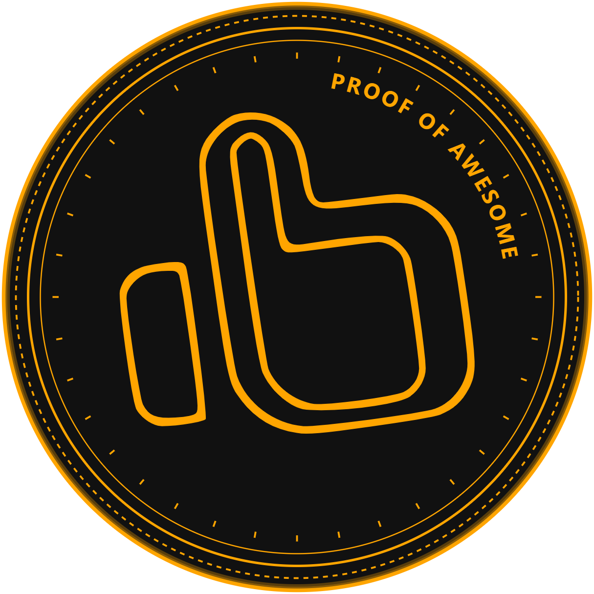

# Proof of Awesome

A blockchain-inspired social platform that transforms real-world achievements into verifiable digital assets.

## 🚀 Overview

**Proof of Awesome** reimagines blockchain technology as a social experience where users "mine" blocks through verified real-world accomplishments rather than computational puzzles. The platform combines blockchain mechanics with achievement tracking to create a compelling social experience with authentic utility.

## ✨ Key Features

- 🏆 **Blockchain-Verified Achievements**: Record your accomplishments permanently on themed blockchains
- 🤖 **AI-Powered Verification**: Get your achievements validated and rewarded through sophisticated AI analysis
- ⛓️ **Themed Achievement Chains**: Join public and private chains focused on fitness, creativity, gaming, and more
- 🪙 **AwesomeCoin Economy**: Earn and utilize tokens with real utility within the ecosystem
- 🔍 **Real-Time Block Creation**: Watch your achievements become blocks in an actual blockchain
- 🌐 **Public & Private Chains**: Participate in public communities or create private chains for specific groups
- 📱 **Cross-Platform**: Access via web app or dedicated iOS application

## 💡 Platform Experience

### Achievement Verification System

Our AI verification analyzes your achievements based on:

- Thematic relevance to the chosen chain
- Detail level and supporting evidence
- Realistic assessment of accomplishment difficulty
- Personal context and growth elements

### Chain Ecosystem

- **Public Chains**: Join themed communities like Fitness King, Home Hero, and Pro Gamer
- **Private Chains**: Create invitation-only chains with custom rules and rewards
- **Chain Explorer**: Discover trending chains and view recent community achievements
- **Block History**: Browse the complete blockchain record of all verified achievements

### User Experience

- **Robinhood-Inspired Design**: Clean, minimal interface focusing on essential information
- **Real-Time Updates**: Watch your achievements transform into blocks in real-time
- **Social Elements**: View and interact with achievements from your network
- **Achievement Streaks**: Build consistent habits by maintaining blockchain-verified activity

## 📱 Platform Support

### Web Application

- Progressive web app accessible from any modern browser
- Full achievement tracking and verification capabilities
- Real-time blockchain visualization

### iOS Native App

- Enhanced mobile experience with native iOS design
- Advanced chain explorer with activity feed
- Push notifications for chain events and verifications
- Integrated trading features

## ⚠️ Important Disclaimer

**Proof of Awesome** is a self-contained ecosystem that does not connect to any real-world blockchain networks or cryptocurrencies. The blockchain mechanics, AwesomeCoins, and all transactions exist solely within our application and have no monetary value or connection to actual cryptocurrency trading platforms. This is an educational and social platform designed to demonstrate blockchain concepts through achievement tracking, not a cryptocurrency or investment vehicle.

## 🔍 Use Cases

### Personal Development

- Track fitness journeys, learning progress, and daily wins
- Create accountability through blockchain verification
- Visualize your progress through growing block chains

### Social Recognition

- Share meaningful achievements with your community
- Receive validation through AI and peer acknowledgment
- Build a permanent record of your accomplishments

### Group Challenges

- Create custom challenges with pooled token rewards
- Verify completion through evidence-based validation
- Track community progress toward shared goals

## 🛠️ Technical Implementation

Built using a modern tech stack:

- **Frontend**: React, Material UI, Socket.io client
- **Backend**: Node.js, Express, Socket.io
- **Blockchain Core**: Custom implementation with cryptographic verification
- **AI Verification**: Advanced prompt engineering for achievement validation
- **Storage**: Distributed ledger with local encryption

## 🔮 Future Roadmap

- Enhanced trading features between chains
- Smart contracts for automated challenges and rewards
- Mobile app for Android
- Advanced governance models for community chains
- Integration with existing fitness and productivity apps

---
